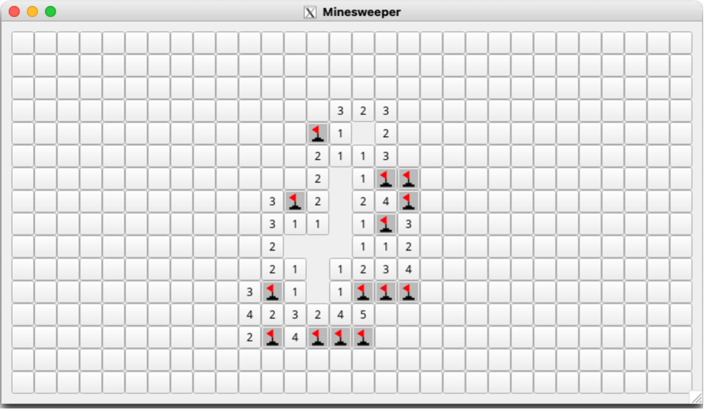

# Minesweeper CS3307 Individual Project
## Purpose 
The general purpose of this assignment is to develop a simple C++ program for a Unix/Linux system (like the Raspberry Pi Desktop), given a number of requirements, making use of the principles and techniques discussed throughout the course. This assignment teaches experience in:
 
- Object-oriented programming using C++, using basic language constructs, classes, and data types  
- Looking through Unix/Linux manual pages and documentation, as you will likely need to do this in your projects later  
- Getting acquainted with Unix/Linux-based programming and services, which will help in project development on this environment later in the course  

## How Minesweeper Works
The game board is a 30x16 grid, 30 spaces wide by 16 spaces high. 
Hidden under those spaces are 99 mines scattered across the board, with each mine located in its own randomly selected space.
The player's goal is to clear the board without detonating any mines.  To guide the player, hints are given as to the number of mines under neighbouring spaces (left, right, up, down, and diagonal).  
Using a combination of deduction and luck, the player selects which spaces to open and explore, and which spaces should be marked as probable mine locations.  
If the player successfully uncovers all non-mine spaces without hitting a mine, they win.  
Otherwise, when the player finds a mine under a space, they lose.
  
Some particulars about playing the game:  
- The game starts with all spaces showing nothing.  
- The player has to make their first move  based entirely on luck, as they have no information to guide them.  
- Every step along the way, the player has two choices:  
1) The player left-clicks a space to open and explore it. If a mine was hidden underneath the space, the mine explodes and the player loses the game.  Otherwise, the player is safe for now and is given a hint.  The space either shows a count from 1-8 of how many mines are in adjacent spaces or is blank if there are no mines in adjacent spaces.  In that case, when there are no mines in adjacent spaces, each adjacent space is then also opened, which could lead to a chain reaction of opened spaces with large gaps, as shown in the screenshot above. 
2) The player right-clicks a space to mark it.  If the space was unopened, it is flagged as a mine.  This is useful when the player believes a mine to be in that space.  If the space was already flagged, it is then marked with a question mark (?) to indicate that the player is not sure if a mine is there or not.  Finally, if the space already contained a question mark, the marking is removed and the space is back to its state prior to being marked in the first place.  (Note that a space that is marked can still be opened with a left-click, so the player must still be careful around them!)
  
When the player opens the last remaining non-mine space, they have safely made their way through things and win the game!

### Core Contributors
Michelle Bourdon  
CS3307 UWO
